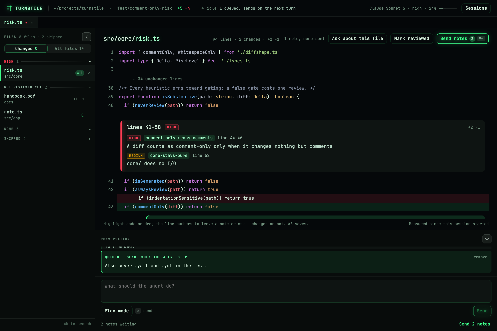
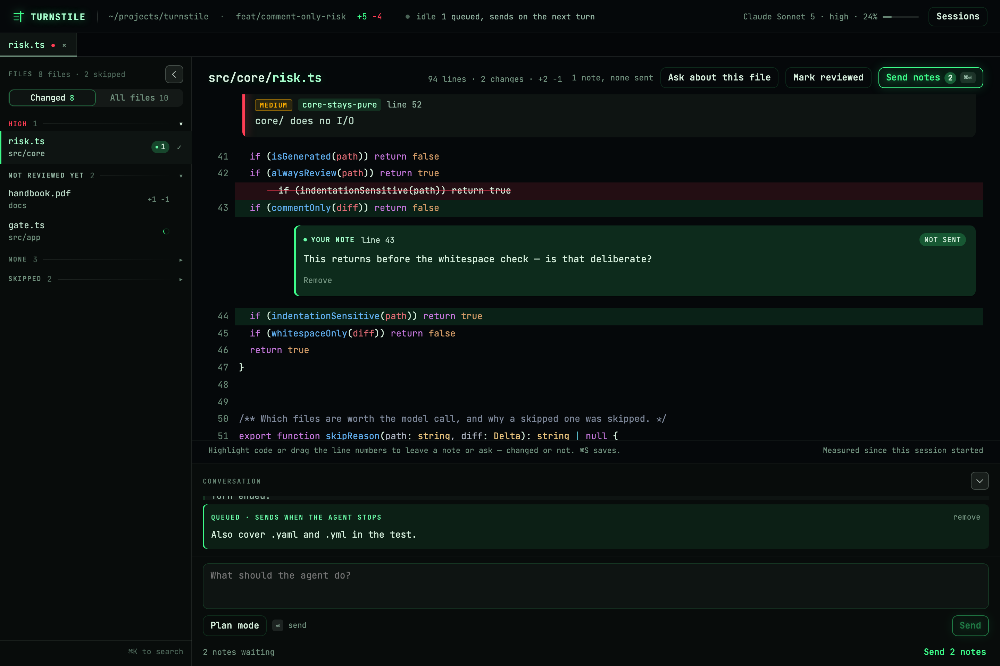
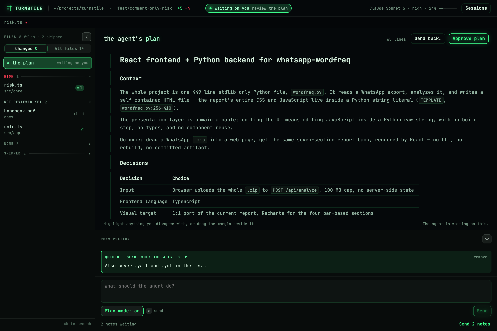

# Turnstile

A review companion for a coding agent. It fights **human cognitive drift**: the slide into
rubber-stamping an agent's changes without actually processing them.

Turnstile is a desktop app for macOS, built with Tauri. You open a repository in it, and
everything happens in its window.

Turnstile *is* the client the agent talks to. It drives Claude Code directly through the
Claude Agent SDK (no separate proxy process in between), runs it right in your checkout, and
shows you everything that session has changed since it started, as it happens. When a turn
that changed something ends, a read-only Claude Code reviewer reads those changes against your
repository's own conventions. You read the diff, leave notes on the lines that matter,
and send those notes to the agent when you're ready. Nothing blocks: the agent is never held
waiting for an approval.



> Turnstile began as a blocking review gate: after every turn the agent waited until you
> approved or sent back each change. That design was replaced by the one described here.

## The premise that must not break

Putting an AI summary between you and the code is the same mechanism that *causes* drift.
Turnstile avoids that by keeping the model's output narrow and the reading yours:

1. **The model flags problems, not a verdict.** Each changed file gets a list of findings —
   usually empty — each one a specific problem the change introduces: where it is, how bad it
   is, and a sentence or two on why. Never a summary of what the change does.
2. **You read the file, not a digest of it.** A changed file opens as the whole file, top to
   bottom, with its changes marked where they fall. Findings sit beside the code; they never
   replace it.

If you find yourself skimming the findings instead of the diff, that is the signal the tool
exists to catch — not friction to design away.

## Requirements

These steps assume macOS.

- **Bun 1.3+**: builds the app's Turnstile process, which the desktop shell runs.
- **Node.js and npm**: run the desktop app's Tauri tooling.
- **Rust**, via rustup, plus the Xcode Command Line Tools. Tauri compiles the desktop shell with them.
- **Claude Code, logged in.** Turnstile drives Claude Code through the Claude Agent SDK, which
  spawns the `claude` CLI itself. The CLI authenticates however it normally does: its own login,
  or `ANTHROPIC_API_KEY` in the environment. Turnstile does not manage that.
- **A TypeSafe API key**, for auto-mode, which decides which tool calls to ask you about (see
  "Tool permissions" below). Without one, every tool call asks you.
- **An OpenRouter API key** (optional), only for asking questions about code (see "Asking about
  code" below). Nothing else uses it: the review runs on Claude Code, like the agent, and
  auto-mode runs on TypeSafe.
- **A git repository to work in.** If the folder you pick isn't one, Turnstile offers to create it.

## Setup

### 1. Install the toolchain

```bash
xcode-select --install                                   # skip if already installed
brew install oven-sh/bun/bun node                        # Bun and Node/npm
curl --proto '=https' --tlsv1.2 -sSf https://sh.rustup.rs | sh   # Rust
npm install -g @anthropic-ai/claude-code && claude       # log in to Claude Code once, then exit
```

### 2. Set your API keys

Export them from your shell profile so every terminal has them, including the one you launch
the desktop app from:

```bash
echo 'export TYPESAFE_API_KEY=...' >> ~/.zshrc          # auto-mode
echo 'export OPENROUTER_API_KEY=sk-or-...' >> ~/.zshrc  # optional: asking about code
source ~/.zshrc
```

- **`TYPESAFE_API_KEY`** is for auto-mode's judge. Without it, auto-mode can't judge anything,
  so every tool call asks you.
- **`OPENROUTER_API_KEY`** is only for "Asking about code". Create one at
  <https://openrouter.ai/keys>. Without it, a question shows an error on its card, and nothing
  else changes.

Turnstile reads keys only from the environment, never from a config file, and checks them each
time it uses one. A missing key never stops the app from starting. To use variables with other
names, set `typesafe.apiKeyEnv` or `openrouter.apiKeyEnv` in config.

### 3. Write your user-level config

A personal config at `~/.turnstile/config.json` applies to every repository you open. A repo's
own `.turnstile/config.json`, if it has one, overrides it field by field (see "Two config
locations" below).

```bash
mkdir -p ~/.turnstile
cat > ~/.turnstile/config.json <<'EOF'
{
  "review": { "model": "sonnet" },
  "ask": { "model": { "models": ["anthropic/claude-haiku-4.5"], "temperature": 0 } },
  "openrouter": { "apiKeyEnv": "OPENROUTER_API_KEY" }
}
EOF
```

Any field you leave out takes its default. "Configuration" below lists every field. Turnstile
**won't start** if this file isn't valid JSON or has a bad value, so a typo shows up right away
instead of being ignored.

### 4. Install dependencies and run the desktop app

```bash
git clone https://github.com/willredington/turnstile.git
cd turnstile
bun install             # the app's own dependencies, needed to build the sidecar

cd desktop
npm install             # Tauri CLI and plugins
npm run tauri dev       # builds dist/turnstile, compiles the Tauri shell, opens the window
```

The first `tauri dev` compiles the Rust side and takes a few minutes. Later runs are quicker.
Each run rebuilds the `turnstile` binary first (`desktop/scripts/prepare-sidecar.mjs`, run with
Bun, so `bun` has to be on your `PATH`), so the window always runs your current source. It
prints the build's hash and commit as it starts. The first time the window opens, pick the
repository you want to work in. After that it reopens the last one. To switch repositories, use
**File → Open Folder…** (⌘O).

Launch it **from a terminal that has your keys set**. The app hands its environment down to
Turnstile, so a key exported only in some other shell won't reach it.

If Turnstile can't find the `claude` binary on its own, set `TURNSTILE_CLAUDE_CODE_EXECUTABLE` to
its path before launching. A packaged build bundles its own and sets this for you.

## How a session goes

```
you type a message
  │
  ├─ first message of a session: your checkout's tree, uncommitted work included, is
  │  recorded as the session's baseline — before the agent can touch anything
  ├─ the agent works in your checkout
  ├─ every edit lands in the changed-files list immediately (read from git, no model)
  └─ the turn ends; the agent is free for your next message
       ...and if the turn changed anything, one review reads every file without a current one
```

Along the way, or afterwards:

- open any changed file to read it whole, with its changes and the review's findings marked;
- drag across any line — changed or not — to leave a note;
- click **Send N notes** when you want the agent to act on them, with or without a message
  of your own.

**Nothing is ever reverted, and nothing is ever waited on.** The agent keeps working; your notes
reach it when you send them.

## The baseline, and what's on the list

The agent works directly in your checkout, the folder you opened in the app. When a
session sends its first message, the checkout's tree as it stands — committed, uncommitted and
untracked files alike — is recorded in git as `refs/turnstile/baselines/<session>`, through a
scratch index that never touches yours. That is the **baseline**.

The changed-files list is simply every file in the checkout that differs from the baseline:

- **committed or not** — both sides are compared as trees, so the agent committing its own
  work never hides it;
- **whoever made it** — the agent's write tool, a shell command, or you editing a file by hand;
- **for the whole session** — the list is cumulative. Resume a session tomorrow, or restart the
  app, and you see everything that has changed since it began, with your notes still attached.

Work you already had in progress when the session started is part of the baseline, so it is
never on the list. The baseline lives in git, not in Turnstile's own state, so there is nothing
to lose or go stale. Turnstile creates no branches and never commits to yours — what happens to
the agent's work is your call, with ordinary git.

Versions before this one ran every session in its own worktree under `.turnstile/worktrees/` on
a `turnstile/<session>` branch. Those are left alone; remove them with `git worktree remove`
and `git branch -D` once you've taken whatever you want from them.

### Marking a file reviewed

Once you've read a changed file, **Mark reviewed** in its header (or the ✓ on its row) moves it into
the folded **reviewed** section at the bottom of the rail, so the rest of the list shows only
what you haven't read yet. If it's open it stays open, and its tab's dot turns green. It stays
there until the file changes again, and then it comes back by itself: new work on a file is never
something you've already read. To bring one back sooner, press
the ↩ beside its row there, or **Unmark reviewed** in its header. Opening a reviewed file — from
the **reviewed** section, the project tree, anywhere — only reads it: the mark is your record of
what you've read, and looking again is not a reason to lose it. What you've reviewed is kept per
session and survives restarts, the same way notes are. A hand edit brings a reviewed file back
on the agent's next action, not straight away.

### Sessions

The **Sessions** menu in the top bar starts a fresh conversation or resumes any past one without
restarting the app. A new session's baseline isn't recorded until you send its first message, so
starting one and never using it leaves nothing behind. Only conversations Turnstile started are
listed — a plain `claude` session run in the same directory has no baseline to measure from.

## Notes

A note is anchored to a file and a line range, and quotes the lines as they read when you wrote
it, so the agent knows which version of the code you were looking at. Notes are kept per
session and survive restarts.



A note is about the file as it stood when you wrote it, so **any change to that file clears
every note on it**, sent or not — a note left pointing at a line it is no longer about is worse
than none. Notes on other files are untouched.

A note goes to the agent **only when you send it** — from the file pane, or from the compose box
in the conversation, where you can add a message of your own. An ordinary message never carries
notes along. Sent notes stay visible, marked as sent, and the conversation shows them with the
message that carried them.

Notes on a file that is no longer changed (the agent reverted it, say) collect in their own
section of the sidebar, so none go missing.

You can also talk to the agent while it is still mid-turn. A message typed then does not
interrupt it — interrupting is how you get half-finished work — it queues, and goes as the next
turn once this one ends. Sending notes mid-turn works the same way.

## Asking about code

A note asks for a change. The other half of reading someone else's work is wanting to know what
something *does*, or why it is the way it is — and wanting to know now, usually while the agent
is mid-turn and in no position to answer.

Select some code and ask. The answer arrives as a card set into the file under those lines, and
you can keep asking follow-ups in it.

- **Select code with the mouse** and a box opens on it straight away, with **Leave note** and
  **Ask**. This works on every file, changed or not. Before a session has opened there's nowhere
  to keep a note, so the box offers only **Ask**.
- **Dragging the line numbers** opens the same box.
- **"Ask about this file"** in the file pane's header asks about the whole thing. That answer
  rides at the top of the document.

It works on any file, changed or not. Half the questions worth asking are about code nobody
touched — and an unchanged file has no review on it to read, so a question is often the only way
in.

Three things it deliberately does not do:

- **The agent does not answer.** It cannot answer while it is mid-turn, which is exactly when
  you want to ask, and your question is not the work — it should not spend the agent's context
  window. A separate, cheaper model answers, configured under `ask` (see Configuration).
- **Nothing changes.** No file is written, no note is stored, no turn is run. The answering
  model is given read-only tools and there is no write tool for it to reach for.
- **Nothing is kept.** Answers are not notes. They survive switching tabs and are gone when you
  close the page. If an answer is worth keeping or acting on, write it as a note — that is the
  thing that persists and reaches the agent.

Without `OPENROUTER_API_KEY`, asking says so on the card rather than hanging. Nothing else needs it.

## Tool permissions

The agent's native `Edit`/`Write` tools are disallowed; Turnstile's own write tool is the only
way a file's contents change, and it only writes inside the repository.

Everything else, such as a shell command or an MCP tool call, goes through **auto-mode**. You
set it up once, in the app. It opens by itself the first time, and you can reopen it later from
**Edit auto-mode** in the top bar, where **Start over** puts back the suggestions. There you say, in plain words, when the agent should ask you first:

- "Runs a command with elevated privileges (sudo, doas, su)"
- "Pushes, publishes or deploys anything"
- "Touches anything under infra/"

Some suggestions are ticked for you. You can reword them, untick them or add your own.

Before each tool call, Turnstile asks TypeSafe one yes/no question per statement, all in one
request: does this call do what the statement describes? Each answer is a probability. If any
statement reaches the threshold, you're asked, and the prompt shows which statements matched.
Otherwise the call runs. A **Sensitivity** setting picks the threshold: Strict (15%), Balanced
(30%) or Relaxed (50%). **Try a command** on the setup screen shows, before you save, what would
happen to a command: each statement reads **Asks** or **Passes**, and so does the call as a whole.
The probabilities themselves are never shown.

**If auto-mode can't decide, you decide.** That covers auto-mode not being set up yet, a missing
`TYPESAFE_API_KEY`, a network error, a slow answer (past `typesafe.timeoutMs`) and an answer
missing for any statement. In each case the call becomes an ordinary prompt that says why.
Identical calls reuse an earlier answer within a run, so repeating `bun test` isn't a round trip
every time. Failures are never reused.

Two things stay outside auto-mode, and no statement changes them:

- A call that names Turnstile's own state (`.turnstile/`, `~/.turnstile`) is refused outright.
- In plan mode, anything that does more than read asks you (see below).

Your statements live in `~/.turnstile/auto-mode.json`, per user rather than per repository. The
agent can't read or change that file. If your config still has `toolPermissions.denyPatterns` from
before auto-mode, the setup screen lists each pattern as a statement for you to reword. The old
key is otherwise ignored.

## Plan mode

Plan mode is available from the compose box: the agent can only read and plan until you answer
the plan it submits.



While it is on, anything that does more than read stops for you — not just file writes through
Turnstile's own tool, but shell commands too. Exploring stays silent (`ls`, `cat`, `rg`,
`git log`, `git diff`, `find`, `sed -n`), and anything else — a redirect, `sed -i`, an install,
a script, a subagent — asks first, saying plan mode is why. Allowing one does not turn plan mode
off.

The agent's own plan file is the exception, and it is not a hole: it writes that through a tool
of Turnstile's own, which can only ever write one markdown file into Claude Code's plan
directory — never into your project. So planning costs you no prompts at all.

This is stricter than the rest of Turnstile on purpose. Everywhere else, auto-mode lets through
what your statements don't describe, because a prompt for every `git status` just teaches you to
click through. Plan mode has no review behind it to catch what slipped past, so the bias flips
for as long as it is on.

A submitted plan arrives **pinned at the top of the review rail**, rendered as the document it is —
headings, steps and prose, not its own markdown source. It is the one surface that does not let
you walk away without answering, because the agent is genuinely stopped until you do. Three ways
out:

- **Approve it.** The agent leaves plan mode and starts work.
- **Send it back.** Say what is wrong and the agent revises and submits again.
- **Note the parts you disagree with, then send it back.** **Highlight** the words you object to,
  or **drag the margin** beside a block — both leave a note anchored to that part of the plan, as
  many as you like. They go back together as the reason, with an optional message on top.
  Approving is refused while a note is outstanding — a note is a disagreement, and approving over
  one would throw it away and tell the agent the plan was fine.

A note is recorded against the plan's *source* lines even though you are reading the rendering,
because the agent wrote the plan as text and is about to revise it as text: "lines 13-14" is
something it can find again.

Once you answer it, the plan moves into the conversation — folded, labelled by what you decided,
and still there when you resume the session later. The pinned entry is for deciding; the record is what
you go back to.

**A plan nobody answered comes back as a plan.** If the session ended while one was on the
table, resuming brings it up again as a decision rather than as history — because it still is
one. The agent is no longer sitting inside that call, so your answer reaches it as its next
instruction instead; everything you do with the plan is otherwise identical.

The plan stays pinned while you read the code it is about, which is usually the only way
to tell whether it is any good. Notes on a plan are not notes on a file: they live only as long
as the round, go back as the plan's verdict rather than as a later message, and are never
written to `.turnstile/annotations.json`.

## The review

When a turn ends having changed something, one reviewer reads **every changed file that has no
current review** — never reviewed, or changed since it was. It is Claude Code itself, run
read-only in your checkout: it loads your repository's `CLAUDE.md` and skills exactly the way the
coding agent does, and those are what it holds the change to. There is no rule file to write.
If a convention matters, it is already in `CLAUDE.md` or a skill, for the agent to follow and
the reviewer to check.

It sees every file under review at once, with their diff against the baseline, and can read,
search and run read-only shell commands (`git log`, `grep`, …) across the rest of the repository,
because whether a change is right often turns on something outside it: a caller the change
broke, a test that should exist, the sibling it should have followed. It cannot write — no edit
tools, and a shell command is let through only if it is read-only — and it is kept out of
Turnstile's own state the same way the agent is.

Its answer is typed. Each finding is:

- **Where**: the lines, in a file under review or any other. A caller the change broke is a
  finding in the caller, tied to the change that broke it.
- **How badly**: `low`, `medium` or `high`.
- **What**: a short title and a sentence or two on what is wrong and why it matters.

An empty list is the expected answer for most changes. It is told to report only what the change
introduces, never what the code already did, and not something that could merely be cleaner.

**Why only at the end of a turn.** Reviewing work the agent is still in the middle of means
reviewing something about to change, and each review is a whole agent run. So the list follows
every edit as it lands, and the review waits for the agent to stop. A turn that changed nothing
(a question, a plan) is not reviewed at all.

**Stale reviews, and Review now.** A file's review holds only while the file is exactly as it
was reviewed. Change it any other way — by hand, with a checkout, from another session — and it
reads **not reviewed** again rather than showing findings about lines that aren't there any
more. Nothing reviews it until the next turn that changes something, or until you press **Review
now** at the top of the rail. That button reviews every changed file without a current review,
and nothing else. Reviews are kept per session in `.turnstile/findings.json`, so resuming a
session — even after a restart — shows every review that still matches its file.

A finding shows on the change whose lines it overlaps, and a change is as serious as its worst
finding. Findings outside every change (unchanged code the change affects, or another file it
breaks) show at the top of the file. The review rail down the left groups the changed files by their
worst finding — high, med, not reviewed yet, low, none, skipped — most serious first; the quiet
groups start folded.

Opening a file from the rail — or from the project tree — puts it in the **tab strip** across the
top, and it stays there until you close it. Everything you open gets a tab, changed or not,
reviewed or not, and each one carries the same coloured dot the project tree gives it: its risk
group, green once you've marked it reviewed, and no dot at all for a file the agent never touched.
Closing a tab means "not now" — a changed file keeps its row in the rail either way.

### What isn't reviewed

These are listed and diffed like anything else, but never sent to the review. Each shows the
reason instead:

- documentation and prose (`.md`, `docs/`, `LICENSE`, `CHANGELOG`, …)
- whitespace and formatting, and comment-only edits
- mechanical (100%-similarity) renames
- generated and vendored paths: lockfiles, `node_modules/`, `vendor/`, `dist/`, `.next/`, `*.snap`

Indentation-significant languages get stricter treatment — reindenting Python or YAML is a
behavior change made entirely of whitespace, so it is checked.

```json
{
  "riskBar": {
    "alwaysReview": ["migrations/**", "src/auth/**"],
    "neverReview": ["generated/**"],
    "specPaths": ["docs/plans/**", "**/*.plan.md"]
  }
}
```

`alwaysReview` forces a review and outranks everything. `neverReview` adds to the built-in
generated and vendored list rather than replacing it. `specPaths` names plan or spec documents
that the documentation rule would otherwise skip. Globs are matched against the path from the
repository root: `*` stays within one directory and `**` crosses directories. So `*.plan.md`
only matches at the root, and `**/*.plan.md` matches anywhere.

### Files and chunks

A change is cut into **chunks**: runs of hunks from one file, coalesced when they sit within a
few lines of each other and split past a line budget. Chunks are what the board shows, and each
finding lands on the chunk whose lines it overlaps. The review itself reads whole files. A chunk
past the analysis budget, or a binary file, is shown in full but not sent to the reviewer, and
says so.

## The diff

Rendered from a parsed patch, not dumped as `git diff` output. Nothing is ever truncated,
placeholdered or dropped — presentation may fold long runs of unchanged lines, never a change.
Each line carries its own number (the old one for a removed line), what was removed stays struck through where it
was, and each change is announced by a card carrying its findings.

## The file explorer

A panel down the left browses the whole project, not just what changed (a dot marks each
changed file), and opens any file read-only. It shows the repository once a session has opened,
and the directory Turnstile was started in before that. It walks the tree the way git does (`.gitignore`
respected, `.git` excluded at every depth, symlinks never followed), and every requested path
is re-resolved against the root before anything is read.

## Snapshots

The checkout is captured through a scratch index, never through its own:

```
GIT_INDEX_FILE=$GIT_DIR/turnstile/index-<pid>-<uuid> git read-tree HEAD
GIT_INDEX_FILE=$GIT_DIR/turnstile/index-<pid>-<uuid> git add -A
GIT_INDEX_FILE=$GIT_DIR/turnstile/index-<pid>-<uuid> git write-tree
```

Reading the tree never touches the index, HEAD, stash, reflog or history. Untracked build output
is kept out by `untrackedExcludes` (`target/`, `node_modules/`, `dist/`, … by default), so an
agent that builds a project before anyone has written a `.gitignore` doesn't flood the list.

## Configuration

```json
{
  "review": { "model": "sonnet", "maxTurns": 60, "timeoutMs": 600000 },
  "ask": {
    "model": { "models": ["anthropic/claude-haiku-4.5"], "temperature": 0 },
    "maxSteps": 6,
    "timeoutMs": 60000
  },
  "riskBar": { "alwaysReview": [], "neverReview": [], "specPaths": [] },
  "typesafe": { "apiKeyEnv": "TYPESAFE_API_KEY", "model": "jev-latest", "timeoutMs": 5000 },
  "untrackedExcludes": ["target/", "node_modules/", "dist/", "build/", ".venv/", "__pycache__/"],
  "openrouter": { "apiKeyEnv": "OPENROUTER_API_KEY" },
  "telemetry": { "enabled": false, "endpoint": "http://127.0.0.1:4318" }
}
```

`review` configures the reviewer, which is Claude Code and authenticates the way the agent does:
- `model`: a Claude model alias (`sonnet`, `opus`) or full id. Left out, it is whatever the
  `claude` CLI defaults to.
- `maxTurns`: model round-trips one review may take. Every read, search and command counts.
- `timeoutMs`: one review's whole budget. It reads every file a turn changed, so it isn't quick.

`typesafe` configures auto-mode's judge (see "Tool permissions"). Your statements aren't set here.
You write them in the app.
- `apiKeyEnv`: the environment variable holding the TypeSafe key.
- `model`: the TypeSafe System One model that answers.
- `timeoutMs`: how long one tool call may wait for a verdict, retries included. The agent is
  blocked meanwhile, so it's short. When it runs out, the call asks you.

`ask` configures answering a question about a selection (see "Asking about code"). It's the only
thing that uses OpenRouter, and `openrouter.apiKeyEnv` names the variable holding its key. It
wants a fast, cheap model, since someone is watching a spinner. It defaults to Haiku. To change
it, set `ask.model.models`: OpenRouter model ids in priority order, where you're billed for
whichever one serves. The model must support tool calling. If you set `ask.model`, include
`models`, since the field is required there.
- `model.temperature`: defaults to 0.
- `model.provider`: optional OpenRouter provider preferences (`order`, `only`, `ignore`,
  `allow_fallbacks`, `sort`).
- `maxSteps`: tool-using steps before it must answer with what it has.
- `timeoutMs`: one question's whole budget, tool calls included. Both attempts of a retried
  question share it, so a failure that is going to be reported is reported inside this budget
  rather than twice it.

`riskBar` picks which changed files skip the review (see "What isn't reviewed").

`untrackedExcludes` lists gitignore-style patterns for untracked files that never reach the
list, on top of your own ignore rules. Setting it replaces the default list rather than adding
to it. Files git already tracks aren't affected.

### Telemetry

Off by default. Turned on, Turnstile exports OpenTelemetry over OTLP/HTTP to `endpoint`:

```json
{ "telemetry": { "enabled": true, "endpoint": "http://127.0.0.1:4318" } }
```

To look at it, start the bundled backend (`telemetry/compose.yaml` — Grafana's all-in-one OTLP
stack, which needs no configuration):

```bash
bun run telemetry          # start it
bun run telemetry:stop     # stop it
bun run telemetry:logs     # follow its logs
```

Grafana is then on http://localhost:3000 (admin/admin), with traces in Tempo, metrics in
Prometheus and logs in Loki. **Dashboards → Turnstile** puts it together, per session or across
all of them: the agent's cost, tokens and events, review and question outcomes, keystroke latency,
and tables of failed model runs and recent turns that open straight into their traces. It is
provisioned from `telemetry/grafana/turnstile-dashboard.json`; edits in the UI are allowed but not
saved back, so export over that file to keep one. History lives in a named volume, so it survives a restart;
`docker compose -f telemetry/compose.yaml down -v` is what throws it away. Turn telemetry on, run a session, and **Explore → Tempo → search by
service** shows both `turnstile` and `claude-code`; filtering a trace on `session.id` puts the
review that ran next to the turn that caused it.

Queries worth having, all verified against a real session:

```promql
sum(claude_code_cost_usage_USD_total)                      # what the agent has cost
sum by (type) (claude_code_token_usage_tokens_total)       # input/output/cacheRead/cacheCreation
sum by (outcome) (turnstile_review_files_total)            # reviewed vs failed vs skipped
sum by (severity) (turnstile_findings_total)               # what the reviewer is finding
sum by (actor, outcome) (turnstile_files_saved_total)      # your saves vs the agent's
turnstile_editor_keystroke_latency_sum
  / turnstile_editor_keystroke_latency_count               # mean keystroke cost, ms
```

Two things export, and they meet in the backend rather than in Turnstile:

- **Turnstile**, as `service.name=turnstile`. Spans for the review pass
  (`turnstile.review.run`, with `turnstile.review.model` around the reviewer's run), for
  `turnstile.diff`, and `turnstile.ask` per question. Under each question, the AI SDK's own
  spans for the run, each step, each model request and each tool call — model, finish reason,
  tokens and tool names, never the prompt or reply — which is where to look when a question
  comes back unanswered. Counters for `turnstile.review.files` (by outcome: reviewed, failed or
  skipped), `turnstile.findings` (by severity), `turnstile.files.saved` (by actor — yours or
  the agent's — and outcome), `turnstile.notes.sent` and `turnstile.ask.questions` (by
  outcome: answered or failed). Histograms, in milliseconds, for
  `turnstile.editor.build` and `turnstile.editor.keystroke.latency`, measured in the app's
  window where the keystroke actually lands, and batched to Turnstile's process.
- **The agent**, as `service.name=claude-code`. The Claude Code CLI is instrumented already, so
  its per-turn spans, model requests, tool calls, tokens and cost come from setting its
  environment rather than from any code here. `"agent": false` leaves it alone.

Both stamp `session.id`, which is what joins them: filter on it to see the review that ran
alongside a turn. They are correlated rather than nested, because the agent SDK opens one
long-lived connection per session — nesting would hang every turn of a multi-hour session off a
single span.

Turnstile asks the agent CLI for **cumulative** metrics
(`OTEL_EXPORTER_OTLP_METRICS_TEMPORALITY_PREFERENCE`). Without that, Prometheus's OTLP ingest
accepts the agent's metrics and then discards them — cost and tokens included — while Turnstile's
own land normally. It is set for you; the note is here because the symptom (half the metrics
missing, no error anywhere) is otherwise very hard to place.

Other fields: `serviceName` (default `turnstile`), `traces` and `metrics` to turn off a signal
(for Turnstile and the agent alike; the agent's logs are always exported while `agent` is on),
`headers` (`key=value,key=value`) for a collector wanting an `Authorization` header, and
`diagnostics` to report export failures instead of dropping telemetry silently — worth turning
on the first time you point at a new collector.

**Nothing you write or say is exported.** Durations, counts, the repository root on diff spans,
the file path on a question's span, model and tool names. Review spans carry a file count, not
paths. Not prompts, not file contents, not API bodies. Claude Code can export those
through four `OTEL_LOG_*` variables; Turnstile never sets them, so enabling them is something
you do deliberately in your own shell.

A collector that is down costs the measurements and nothing else: flushes are time-bounded, so
a stale `endpoint` cannot delay a session or stop the process exiting.

### Two config locations

`.turnstile/config.json` in the repo is read, and so is a personal `~/.turnstile/config.json` for
defaults you want everywhere. Where both exist, a field the repo sets overrides your personal
one, while a field only your personal config sets still applies. Arrays are replaced wholesale
by whichever file sets them, never concatenated. Put only the fields a project needs in its
`.turnstile/config.json`, since each one overrides your personal config. There's no need to
gitignore `.turnstile/`: Turnstile keeps it out of `git status` itself, through the repository's
`.git/info/exclude`.

Auto-mode's statements aren't in either file. They're in `~/.turnstile/auto-mode.json`, written
by the app's setup screen.

## Failure behavior

| Situation | Behavior |
|---|---|
| Not a git repository | No session opens; the app offers to initialize the repository |
| The review fails (Claude Code not logged in, an outage, a timeout) | Its files stay on the list, marked "review failed" with the error. The next turn that changes something, or **Review now**, retries them |
| Malformed `.turnstile/config.json` | **Won't start** — a config that throws is safer than one that silently falls back to defaults you didn't choose |
| Auto-mode can't answer (not set up, no `TYPESAFE_API_KEY`, an outage, a timeout) | Every tool call asks you, and the prompt says why. Nothing runs unchecked |
| Agent process fails to spawn | Surfaced as a visible error in the conversation, not a silent hang |

## Architecture

Ports and adapters, in a strict downward stack:

```
core/       domain types, chunking, risk bar, notes, port interfaces
            zero I/O — no filesystem, no network, no process
   ↑
app/        session.ts, board.ts, review.ts — the pipeline, against ports only
   ↑
adapters/   agent-sdk · git · model · web · fs — each may import core, never a sibling adapter
   ↑
cli/        composition root and the entry point the desktop app launches (a historical name:
            there is no command-line interface)
```

The boundaries are enforced, not documented: `tests/architecture.test.ts` walks the real import
graph and fails the build on an illegal edge, naming it. The pipeline runs against fakes in
tests — no git, model or agent needed.

The UI is a real React app under `adapters/web/ui/`, bundled by Bun itself with no Vite and no
separate build step, and embedded into the binary by `bun build --compile`. The desktop app runs
that binary as a sidecar and shows the UI it serves in its own window.

## Development

```bash
bun run typecheck && bun run lint && bun test
bun run desktop        # the desktop app from source (tauri dev), rebuilding Turnstile first
bun run build          # just the Turnstile process: dist/turnstile, with the UI embedded
```

`bun run simulate` serves the UI against a fake, hand-built session, with fixed files, a fixed
diff and a fixed transcript, so you can work on the UI in a browser without an agent, a git
repository or any model or API key. It's a development tool, not a way to use Turnstile. The
screenshots in this README were taken from it.

For the real thing, open a scratch repository in the desktop app. The agent works directly in
whatever folder you open.

The test suite needs no network access and no API key. The review, questions and auto-mode's
judge sit behind the `Reviewer`, `Asker` and `CallJudge` ports and are faked in tests. The
reviewer's own adapter is driven by a scripted `query()` in place of Claude Code, and auto-mode's
TypeSafe adapter by an injected `fetch`.

## Scope

**Out of scope by design:** reverting or rolling back changes, committing the agent's work for
you, and acting as the merge/CI gate. Turnstile helps you read a working session as it happens;
the merge gate is a separate, final backstop.
